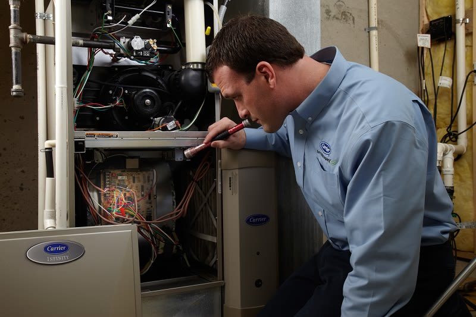

For many Americans, fall signals the time to retreat to the comfort of their home, dust off the TV remote, and sink into the couch for their weekly dose of football.

When you’re setting your calendar for the first big game of the season, why not pencil in a reminder to [contact your local Carrier HVAC contractor](/contact/) for a routine tune-up of your furnace? Regular, scheduled maintenance of your heating system can be the catalyst for:

- keeping utility bills under control
- preventing bigger (and potentially more expensive) repairs down the road
- extending the life of the system

Here’s why: when your HVAC system is running, airborne pollutants like dust, and more can collect on its interior surfaces. These particles can accumulate over time, and if not addressed they can:

- restrict airflow
- reduce comfort
- reduce energy efficiency
- reduce the life of the system through corrosion and material breakdown

### DIY or Schedule Maintenance With a Professional?

<a href="https://www.carrier.com/residential/en/us/products/air-conditioners/air-conditioner-maintenance/how-to-change-air-conditioner-filters/" target="_blank" rel="noopener noreferrer">Cleaning or replacing the system’s air filter</a> is an easy DIY project most homeowners can handle, and it definitely helps reduce the buildup of contaminants in your heating system. However, professional HVAC technicians have the equipment and expertise to dig a little deeper. They can:

- clean and tune up interior components
- evaluate system operation to be sure the unit is heating effectively
- make minor repairs that might prevent bigger ones in the future

### What to Expect During an Hvac Service Appointment

A standard furnace maintenance appointment, often marketed as a “clean and check” generally lasts about an hour In most cases, your technician will run the system in all of its modes to check that heating temperatures are correct, the system is functioning correctly, and there are no signs of malfunction. While every contractor is a little different, your tune-up might include:

1. Make sure all electrical and gas connections are sound and components are working properly
2. Check for secure physical connections of individual parts
3. Check the igniter - new furnaces don’t have pilot lights
4. Check the flame sensor if applicable
5. Inspect and clean the burners
6. Inspect the heat exchanger for signs of damage such as cracks or corrosion
7. On 90% AFUE or higher furnaces, inspect and clean condensate drain lines
8. Check the static pressure – it will be different for fixed-speed or variable-speed models
9. Do a combustion analysis
10. Check and if necessary, adjust gas pressure
11. Inspect the vent pipe for loose fittings and proper support
12. Check and if needed, re-set the heat-off delay

The cost will vary depending on your dealer, but many HVAC contractors offer special pricing for clean and check visits, or offer service contracts that include spring and fall checkups along with preferred pricing for additional service and parts.

So, if the days are getting shorter and you can hear the recliner and TV remote calling your name, it may be time to make a call of your own – to your favorite [Carrier dealer](/contact/). Scheduling a heating system tune-up can go a long way towards ensuring a comfy, cozy and reliable autumn.
