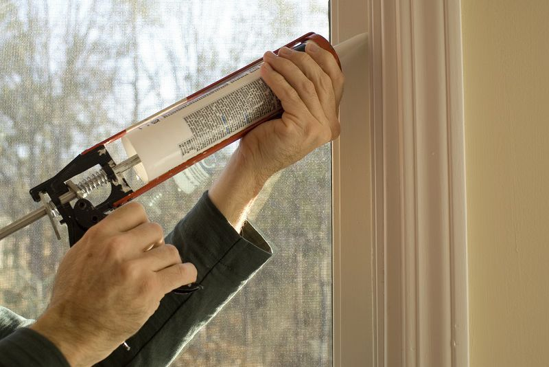

Old Man Winter is on his way, and he’s packing his usual bag of tricks – snow, sleet, freezing temperatures and more. But before you start waxing your skis and dragging out the old toboggan, it’s time to start winterizing your home to protect it – and your family – from the elements.

## 1. Check Seals Around Windows and Doors

Any entryway into your home can let heated air out and colder air in if not properly sealed.

**Windows**: Use plastic cling wrap or buy a window sealing kit from a local retailer. Also, insulated drapes or window coverings can help reduce drafts and energy loss.

**Doors**: Check, and if necessary, replace the weather stripping around the frame of all exterior doors.

## 2. Caulk, Paint, Repair

**Caulk**: Check your home exterior for gaps in door and window frames, wood trim, fireplaces and locations where wiring and piping enter your home. Use a high-quality caulk to seal any gaps.

**Paint**: Look for exposed wood surfaces. Scrape any loose paint, clean the area, and apply a good quality paint to protect the wood.

**Repair**: Visually inspect your home for loose shingles, poorly installed siding, rotting wood or cracks in masonry. Hire a contractor if you cannot make the repairs yourself.

## 3. Clean the Dryer Vent

While this one is easy to forget, your dryer vent will build up a layer of lint during normal operation, causing longer drying time and worse – it can be a fire hazard. Cleaning your dryer vent about every six months, including once in the fall, should be on everyone’s to-do list. If you can’t do it yourself, hire a reputable vent-cleaning contractor.

## 4. Smoke & Carbon Monoxide (Co) Detectors

It’s always a good idea to check your smoke alarms and [CO detectors](/products/indoor-air-quality/carbon-monoxide-alarm/) on a regular basis. And because you will likely be spending more time inside and potentially using CO generating appliances such as a gas furnace during the winter, fall is a great time to test and if necessary, replace your smoke alarms and CO detectors.

## 5. Furnace Maintenance

Inspect your furnace filter monthly and replace as needed according to the manufacturer’s recommendations. Hire a qualified Carrier [HVAC contractor](/contact/) to perform an annual maintenance and cleaning [appointment for your heating system](/blog/kick-off-fall-with-a-furnace-clean-and-check/).

Taking the time to tackle these tasks can help save energy, improve your family’s comfort and help prevent bigger home repairs down the road.
