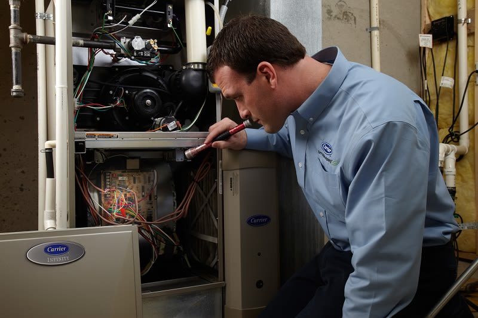

You might be the type to turn on your [furnace](/products/furnaces/) at the slightest hint of a chill in the air. Or, maybe you hold out for that first, all-out bitter cold snap. Either way, if you smell something funny from your furnace the first time you turn it on for the heating season, don’t panic. It might be normal. Here are some smells that might come from your furnace, what they are, and what – if anything - you should do about them.

## Normal Dust Burn-off

When the furnace isn’t actively heating, dust and dirt particles can settle inside the furnace and on internal components. When you turn on the furnace the dust burns off, causing a light burning smell that should dissipate relatively quickly. If it lingers beyond an hour or so, check the air filter and replace it if needed, or contact your local Carrier dealer to inspect the system.

## Not-So-Normal Odors

While that initial dusty/burnt smell is fairly common, there are some not-so-normal odors you should be aware of as well:

- **Electrical, metallic or plastic burning smell** – Follow your nose to locate the source. If it’s coming from your furnace it could be an overheated motor, worn bearing or a wiring issue – and, it’s time to call your local Carrier HVAC contractor. If it’s coming from a specific register/vent, it could be a plastic toy or other foreign object in the duct. Again, it’s best to call a qualified HVAC technician or duct specialist if you don’t see an object in the duct.
- **Musty/moldy/locker room smell** – Your air filter could be overly dirty, or you may even have a little mold or bacterial buildup in your HVAC system. Check and replace the filter if needed. Another source could be organic growth on the cooling (evaporator) coil or in your ductwork. Both of those will require professional cleaning by an [HVAC contractor](/contact/) or duct cleaning specialist.
- **Rotten eggs/sulfur** – Any time you smell rotten eggs or sulfur when gas appliances are in the home, it’s time to leave the premises and call the gas company – immediately. Gas leaks are dangerous and should always be handled by trained professionals.

Better yet, to reduce the likelihood of an untimely furnace issue, get in the habit of scheduling a fall [furnace maintenance](/blog/kick-off-fall-with-a-furnace-clean-and-check/) BEFORE the weather turns cold. Your [local Carrier dealer](/contact/) can clean, check and inspect your entire system, then offer recommendations on any minor repairs that can keep your system running, and your family comfortable.

<small>Sources: https://www.angieslist.com/articles/whats-funny-smell-when-heat-turns.htm; https://adventair.com/blog/burning-smell-furnace/</small>
