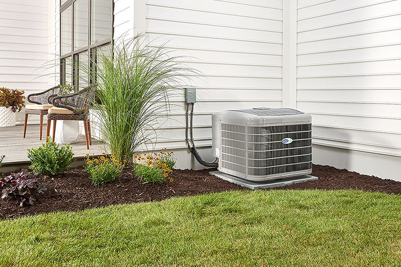

Greenspeed intelligence maximizes the performance of adaptable-speed technology, whether in the form of modulating valves or variable-speed compressors.

The key to unlocking the full potential of adaptable-speed technology is our exclusive Infinity control. The control uses all the information it knows about your comfort choices, your home’s energy use, the system as a whole and even the temperature outdoors to communicate with the system. So new Infinity systems with Greenspeed intelligence continually respond to the Infinity control’s commands to adjust with great precision to the comfort needs of the home.

### Energy Savings

Only Carrier® systems possess Greenspeed™ intelligence, providing homeowners with consistent comfort, precisely matching to the heating or cooling demands of the home. This translates into miserly energy use and the near-elimination of temperature swings throughout a home. In fact, the Carrier Infinity® 20 heat pump with Greenspeed intelligence is so efficient it has 29-69% greater heating efficiency than other air source heat pumps available today.

### Reduce Temperature Swings

Carrier® adaptable-speed products are able to uniquely respond to the Infinity® control’s commands due to their ability to adapt their heating or cooling output in tiny increments.

As outdoor conditions change the comfort demands inside the home over the course of a day or even an hour, a constant stream of information is exchanged between the Infinity control and the system. Adaptable-speed components backed by Greenspeed™ intelligence are able to take the control’s commands and make very subtle adjustments to meet the comfort needs of the home.

This allows the system to operate longer at steadier, lower capacities, which ensures incredible energy efficiency and quiet operation with tighter temperature control than standard systems.

### Super Quiet

Adaptable-speed Infinity® series products with Greenspeed™ intelligence are a rare breed. They provide homeowners with unwavering comfort, precisely matching to the heating or cooling demands of the home. For you, this means they run more economically at lower capacity for longer stretches, keeping temperatures more consistent from room to room and a refreshing airflow throughout the house. And, lower capacity runs means quieter operation. So quiet, you’ll forget it’s there.
